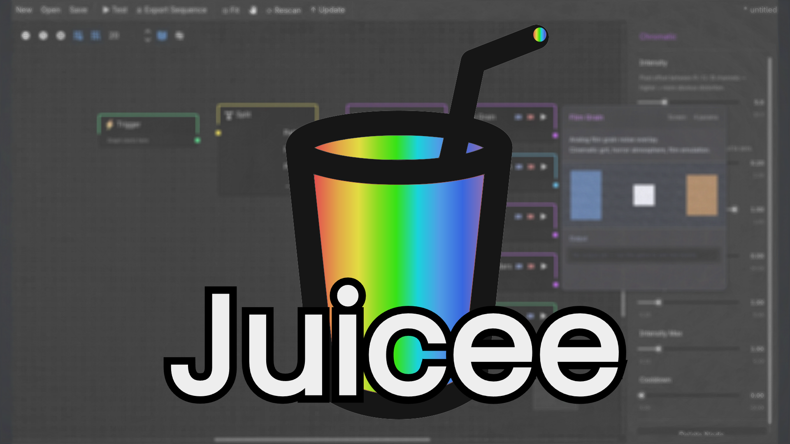
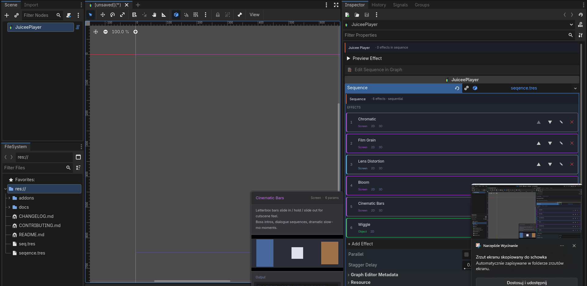

<p align="center">
  
</p>

# 🧃 Juicee

**Game-feel effects for Godot 4 — 94 effects, a visual graph editor, a custom inspector, and a one-line API. Free & MIT.**

[](https://godotengine.org)
[](LICENSE)
[](#whats-inside)

## 🎬 Demo

**Same enemy hit — with and without Juicee.** One squashes, flashes, throws a particle burst and a crit number; the other just sits there.

<p align="center">
  
</p>

<table>
  <tr>
    <td width="50%" align="center" valign="top">
      <br>
      <sub><b>Inspector</b> — build a sequence with sliders</sub>
    </td>
    <td width="50%" align="center" valign="top">
      <br>
      <sub><b>Graph editor</b> — wire effects visually</sub>
    </td>
  </tr>
</table>

```gdscript
# Drop-in presets — one line, done:
Juicee.preset_hit(enemy)
Juicee.preset_hit_crit(enemy)
Juicee.preset_explosion(self)
Juicee.preset_level_up(self)
Juicee.preset_damage_taken(player)
Juicee.preset_death(player)
Juicee.preset_combo(self)
Juicee.preset_dash(self, direction)
Juicee.preset_pickup(coin_node)
Juicee.preset_boss_intro(self)
Juicee.preset_low_health_pulse(player_sprite)
Juicee.preset_victory(self)

# Or individual effects:
Juicee.shake_camera(self, 12.0, 0.3)
Juicee.damage_number(enemy, 999, true)   # crit!
Juicee.bloom(self, 1.5)                  # WorldEnvironment glow
Juicee.spring(my_button, "scale", Vector2(0.4, 0.4))  # bouncy UI
```

Three ways to use the same effect set:

- **Inspector** — drop a `JuiceePlayer` node, build a sequence in the custom card UI
- **Visual graph editor** — wire effects in the JuiceeGraph bottom panel with Trigger / Split / Loop / Random
- **Singleton** — one-liner from any script (shown above)

All three workflows persist as the same `JuiceeSequence.tres`.

---

## Install

1. Copy `addons/juicee/` into your project's `addons/` folder
2. **Project → Project Settings → Plugins** → enable **Juicee**
3. (Optional) **JuiceeGraph** panel appears at the bottom of the editor

Requires **Godot 4.3+** (uses the `@experimental` annotation). Works in all three renderers — Forward+, Mobile, and Compatibility — because the screen effects read the viewport through a `BackBufferCopy` + `hint_screen_texture` overlay rather than a renderer-specific buffer.

### Updating

Godot has no built-in addon updater. Click **↑ Update** in the JuiceeGraph toolbar — it hits the GitHub releases API, shows the latest release notes, and (on confirmation) downloads + extracts the new archive over `addons/juicee/`. Restart the editor afterwards.

### A note on previewing shader effects

Full-screen shader effects (Blur, Chromatic, Glitch, Vignette, Pixelate, Color Grade, Screen Tint, Screen Wipe) sample Godot's `SCREEN_TEXTURE`, which in **editor preview** (Inspector ▶ Preview, JuiceeGraph ▶ Test) is clamped to the editor's preview viewport rectangle. When testing in-editor you'll see a **soft amber outline** marking that area, with a label reminding you to run the project for the real thing.

**Run the project (F5 / F6)** to see these effects at their true full-screen extent. All other effect categories (Camera, Object, Time, Audio, Physics, Flow) preview accurately in the editor.

---

## Quick start

### Singleton (1 line — fastest)

```gdscript
# From any script, anywhere in your game
Juicee.shake_camera(self, 12.0, 0.3)
Juicee.hit_stop(self, 0.08)
Juicee.flash(my_sprite, Color.RED)
Juicee.burst(my_node2d, 20, Color.YELLOW)
Juicee.slow_mo(self, 0.2, 0.5)
```

### Inspector (designer-friendly)

```gdscript
@onready var juicee: JuiceePlayer = $JuiceePlayer
func _on_hit(): juicee.play()
```

1. Add a `JuiceePlayer` node to your scene.
2. Click it in the scene tree.
3. The custom Inspector shows an "**+ Add Effect**" dropdown with all 94 effects.
4. Pick effects, tweak sliders, click **▶ Preview Effect**.
5. Call `juicee.play()` from code.

### Visual graph editor

1. Open the **JuiceeGraph** bottom panel.
2. Right-click in the canvas → the add-node popup. Browse by **collapsible category** (Screen / Camera / Object / Time / …) or just type to fuzzy-search across everything (↑↓ to move, Enter to drop).
3. Drop a **Trigger** node, then effect nodes, wire them up.
4. Add **Loop** / **Random** / **Split** to control flow.
5. **▶ Test** — preview the whole graph, blocks pulse as they fire.
6. **Save** → `.tres` graph; **⤓ Export Sequence** → a `JuiceeSequence.tres` ready for `JuiceePlayer.sequence`.

### C# / .NET

The full singleton API is callable from C# via the bundled bridge — `using JuiceeFX;`:

```csharp
Juicee.ShakeCamera(this, 12f, 0.3f);
Juicee.HitStop(this, 0.08f);
Juicee.Flash(mySprite, Colors.Red);
Juicee.PresetHitCrit(this);
```

Requires the .NET build of Godot with the plugin enabled. See [`docs/csharp.md`](docs/csharp.md).

---

## What's inside

**94 effects** in 8 categories + 12 drop-in presets + built-in updater:

| Category | Count | Effects |
|---|---|---|
| **Screen** | 18 | Chromatic, Vignette, Blur, Pixelate, Glitch, Color Grade, Screen Tint, Screen Wipe, Bloom, Tonemap, Shockwave, Cinematic Bars, Scan Lines, **Speed Lines** ✨, Film Grain, Radial Blur, Lens Distortion, Depth of Field |
| **Camera** | 9 | Shake (2D / 3D), Zoom, FOV 3D, Camera Follow, Directional Shake, Camera Bob, Zoom Pulse, Camera Rotation (Dutch Tilt) |
| **Object** | 36 | Flash, Modulate, Bounce, Jiggle Physics, Position (2D / 3D), Rotation (2D / 3D), Trail, Burst, Confetti, Light Flash, Spring, Ambient Flash, Strobe Light, Recoil, Outline, Color Cycle, Spin, Wiggle, Sprite Bob, Pop In, Shake Control, Pulse, Shader Parameter, Flicker, Scale To, Particle Control, Light 3D Flash, Material 3D, Fade, Flip, Instantiate, Size Delta, **Impact Ring** ✨, **Sway** ✨ |
| **Text** | 6 | Damage Number (with crit), Floating Text, Button Punch, Typewriter, Number Count, Text Wobble |
| **Time** | 4 | Hit Stop, Time Scale Ramp, Delay, Freeze Frame |
| **Audio** | 7 | Sound, Music Duck, Rumble, Reverb, Pitch Shift, **Low-Pass (Muffle)** ✨, Audio Source 3D |
| **Physics** | 2 | Impulse (RigidBody2D), Add Force (2D / 3D) |
| **Flow** | 12 | Sequence (nested), Property Tween, Animation Player, Set Active, Chain, Beat Sync, Wait For Input, Emit Signal, Debug Log, Animation Tree, Set Property, Auto Destruct |

✨ = new in 1.2.0

### Built-in drop-in presets (one-line API)

```gdscript
Juicee.preset_hit(target)                    # shake + flash
Juicee.preset_hit_crit(target)               # hit_stop + bigger shake + chromatic + flash
Juicee.preset_level_up(target)               # shake + zoom + bounce + confetti + warm tint
Juicee.preset_damage_taken(player)           # hit_stop + shake + red tint + vignette + rumble
Juicee.preset_death(player)                  # slow-mo + blur + pixelate + grayscale + glitch
Juicee.preset_explosion(target)              # hit_stop + burst + shake + chromatic
Juicee.preset_combo(target)                  # 3× escalating hit-stops + chromatic + burst 🔥
Juicee.preset_dash(target, direction)        # chromatic + blur + zoom + position kick 🔥
Juicee.preset_pickup(item_node)              # bounce + flash + confetti + floating text 🔥
Juicee.preset_boss_intro(target)             # zoom + vignette + shake + ominous red tint 🔥
Juicee.preset_low_health_pulse(sprite)       # sustained red ambient flash (stoppable) 🔥
Juicee.preset_victory(target)                # confetti + zoom + color cycle + rumble 🔥
```

No `.tres` lookup, no graph editing required — these build the sequence inline and play it.

### Native Godot integration (no custom shaders for these)

- **Bloom** / **Tonemap** — animate your existing `WorldEnvironment` post-process settings. Zero performance overhead, works in 2D + 3D.
- **Reverb** / **Pitch Shift** / **Low-Pass** — temporarily inject `AudioEffectReverb` / `AudioEffectPitchShift` / `AudioEffectLowPassFilter` on any audio bus with smooth ramping. Low-Pass is the muffled-on-hit / underwater / stunned feel — pairs perfectly with Hit Stop.
- **Spring** — harmonic oscillator on any Vector2 property. Universal bouncy menus, squash-on-hit, panel-into-view animation.

### Curve-based parameters (designer-controlled feel)

Effects can opt into a `Curve` resource for any tweenable property — designers paint a custom easing shape directly in the Inspector. Punch, overshoot, settle, bounce — all without touching effect code. Falls back to standard `set_trans` / `set_ease` if no curve is set.

**Every effect inherits:**

- `chance: float` — probability the effect fires when triggered
- `delay: float` — pre-delay before applying
- `intensity_min/max: float` — random intensity multiplier per play
- `cooldown: float` — minimum seconds between fires
- `stop()` — kills any in-flight tweens + cancels manual-loop effects
- `is_playing() -> bool` — query active state
- Signals: `started`, `finished`, `stopped`

## Concurrent effects

If two effects modify the same property at once (e.g., two `JuiceeShakeEffect`s on the same camera), Juicee's ref-counted `JuiceeStateStack` ensures the camera returns to its TRUE original value when both finish — not a mid-shake snapshot.

```
Effect A captures cam.offset = (0,0)          # true original
Effect B captures cam.offset = (0,0)          # gets same baseline (ref-count = 2)
... both shakes run, blending on cam.offset ...
Effect A ends → refs = 1 (no restore yet)
Effect B ends → refs = 0 → cam.offset = (0,0) restored
```

You don't have to do anything — it just works.

---

## Runtime params (reactive effects)

Pass a dict to `play()` so effects can react to gameplay state:

```gdscript
# Camera shake biases AWAY from the hit direction
juicee.play({"hit_direction": (hit_position - global_position).normalized()})
```

Effects access via `_runtime_params.get("key", default)`.

`JuiceeShakeEffect` ships with `hit_direction` support — write your own to read whatever your game wants to pass.

---

## See also

| Doc | What's in it |
|---|---|
| [`docs/api-reference.md`](docs/api-reference.md) | Full API for every core class: JuiceeEffect, JuiceeSequence, JuiceePlayer, JuiceeStateStack, JuiceeAccessibility, JuiceeBeatClock, JuiceeGraphPlayer |
| [`docs/effects-reference.md`](docs/effects-reference.md) | All 94 effects with every `@export` parameter documented |
| [`docs/singleton-api.md`](docs/singleton-api.md) | Full `Juicee.*` singleton method listing with signatures |
| [`docs/csharp.md`](docs/csharp.md) | Using the entire Juicee API from C# / .NET projects |
| [`docs/procedural-sfx.md`](docs/procedural-sfx.md) | Procedural sound effects (sfxr, _experimental_) — synthesize retro SFX with zero audio assets |
| [`docs/graph-editor.md`](docs/graph-editor.md) | Graph editor: nodes, debug test, shortcuts, saving, popup search |
| [`docs/architecture.md`](docs/architecture.md) | Internals: generation tokens, overlay pattern, state stack, shader rules, graph execution, accessibility |
| [`docs/how-to-write-effect.md`](docs/how-to-write-effect.md) | Write a new effect in 30 lines — patterns, anti-patterns, contribution guide |
| [`docs/philosophy.md`](docs/philosophy.md) | When to use Singleton vs Inspector vs Graph, and why |

---

## Community

Got a cool effect or preset? Two ways to share:

- **[Pull Request](CONTRIBUTING.md#option-a--pull-request-official-inclusion)** — if it's broadly useful, ship it in the next release for everyone
- **[Discussions](https://github.com/Kelpekk/Juicee/discussions)** — for game-specific presets, experimental effects, or just show-and-tell

See [CONTRIBUTING.md](CONTRIBUTING.md) for both paths.

---

## License

MIT — free for personal and commercial projects.
