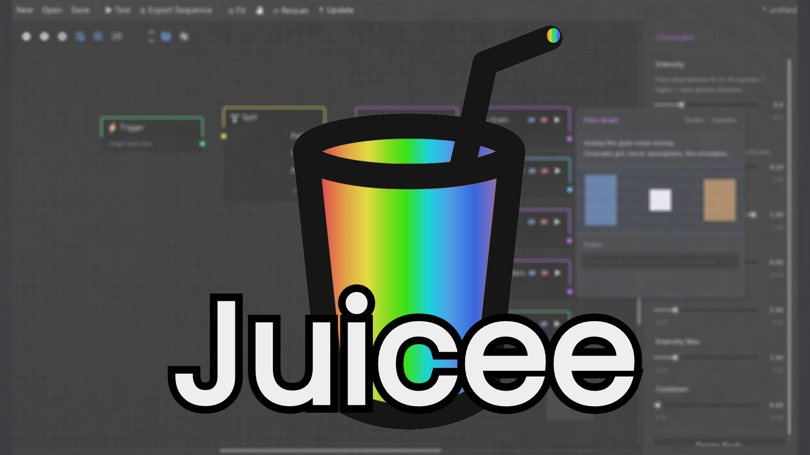
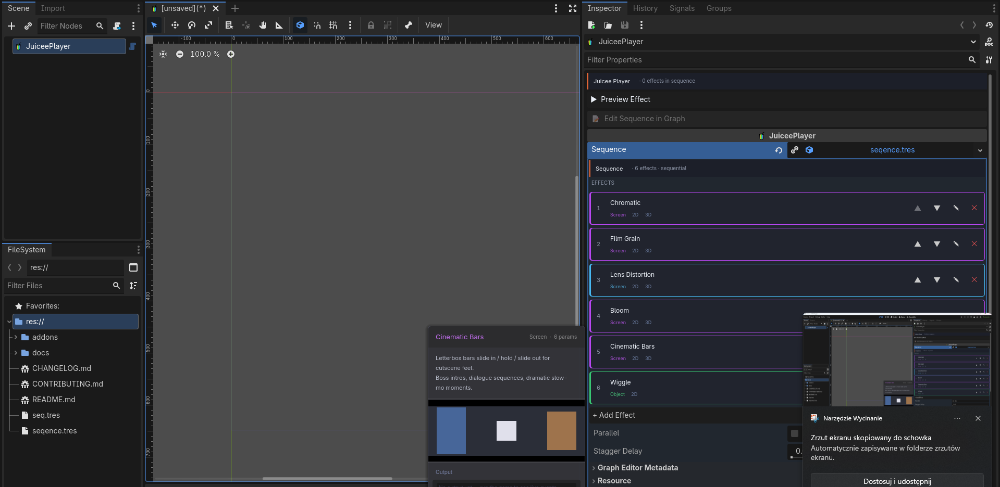

<p align="center">
  
</p>

# 🧃 Juicee

Game feel for Godot 4. Screen shake, hit-stop, squash, particle bursts, damage numbers, and a bunch more. Fire them in one line, or stack them into sequences. Free and MIT.

[](https://godotengine.org)
[](LICENSE)
[](#whats-in-it)

## Demo

<table>
  <tr>
    <td width="50%" align="center" valign="top">
      <br>
      <sub><b>Inspector</b>: stack effects with sliders</sub>
    </td>
    <td width="50%" align="center" valign="top">
      <br>
      <sub><b>Graph editor</b>: wire them up visually</sub>
    </td>
  </tr>
</table>

## Quick start

The fastest way in is the singleton. Call it from anywhere:

<table>
  <tr>
    <td valign="middle">

```gdscript
Juicee.bounce(tomato)                 # squash and stretch
Juicee.jiggle(tomato)                 # springy wobble
Juicee.sprite_bob(tomato)             # a gentle bob
Juicee.flash(tomato, Color.WHITE)     # a bright pop
Juicee.burst(tomato, 20, Color.RED)   # a splash of juice
```

</td>
    <td width="44%" valign="middle">
      
    </td>
  </tr>
</table>

If you'd rather not pick effects one by one, there are 18 presets that bundle a few together:

```gdscript
Juicee.preset_hit(enemy)
Juicee.preset_explosion(self)
Juicee.preset_level_up(self)
Juicee.preset_pickup(coin)
# ...and 14 more
```

## Three ways to use it

Same effects, three workflows. Pick whatever suits you:

- **Singleton:** one line from code, like above.
- **Inspector:** add a `JuiceePlayer` node and build a sequence with sliders. There's a Preview button so you can tweak without running the game.
- **Graph editor:** wire effects together in the JuiceeGraph bottom panel, with Trigger / Loop / Random / Split nodes for flow. Drop the saved graph on a `JuiceePlayer.graph` (or call `Juicee.play_graph`) and it plays back with the branching intact, no flattening.

Sequences and graphs are plain resources, so you can build in the graph and play it from code, drop it on a node, or mix and match.

## Install

1. Copy `addons/juicee/` into your project's `addons/` folder.
2. Project Settings > Plugins > enable Juicee.

Needs Godot 4.3 or newer. Works in all three renderers (Forward+, Mobile, Compatibility).

There's also an Update button in the JuiceeGraph toolbar that pulls newer releases straight from GitHub.

## What's in it

117 effects across 8 categories:

| Category | Count | Effects |
|---|---|---|
| **Screen** | 18 | Chromatic, Vignette, Blur, Pixelate, Glitch, Color Grade, Screen Tint, Screen Wipe, Bloom, Tonemap, Shockwave, Cinematic Bars, Scan Lines, Speed Lines, Film Grain, Radial Blur, Lens Distortion, Depth of Field |
| **Camera** | 9 | Shake (2D / 3D), Zoom, FOV 3D, Camera Follow, Directional Shake, Camera Bob, Zoom Pulse, Camera Rotation |
| **Object** | 50 | Flash, Modulate, Bounce, Jiggle, Position / Rotation (2D / 3D), Trail, Burst, Confetti, Light Flash, Spring, Ambient Flash, Strobe, Recoil, Outline, Color Cycle, Spin, Wiggle, Sprite Bob, Pop In, Shake Control, Pulse, Shader Parameter, Flicker, Scale, Scale 3D, Particle Control, Light 3D, Material 3D, Fade, Flip, Instantiate, Size Delta, Impact Ring, Sway, Squash Land ✨, Hit Spark ✨, Afterimage ✨, Slash Arc ✨, Impact Cracks ✨, Sparkle ✨, Jelly Wobble ✨, Stretch ✨, Glow Pulse ✨, Heartbeat ✨, Hop ✨, Wobble Rotation ✨, Breathe ✨ |
| **Text** | 8 | Damage Number, Floating Text, Button Punch, Typewriter, Number Count, Text Wobble, Text Scramble, Rich Text Emphasis ✨ |
| **Time** | 5 | Hit Stop, Time Scale Ramp, Delay, Freeze Frame, Stutter |
| **Audio** | 10 | Sound, Procedural Sound, Music Duck, Rumble, Reverb, Pitch Shift, Low-Pass, Audio Source 3D, Distortion, Tremolo ✨ |
| **Physics** | 5 | Impulse, Add Force (2D / 3D), Knockback, Explosion Push ✨, Gravity Shift ✨ |
| **Flow** | 12 | Sequence, Property Tween, Animation Player, Set Active, Chain, Beat Sync, Wait For Input, Emit Signal, Debug Log, Animation Tree, Set Property, Auto Destruct |

✨ = added in latest update

Every effect also has a few shared knobs: `chance`, `delay`, random `intensity`, `cooldown`, and `stop()` / `is_playing()`. There's an accessibility layer too (global reduced-motion / no-flash / no-screenshake toggles).

## C#

The whole singleton API works from C# as well:

```csharp
Juicee.ShakeCamera(this, 12f, 0.3f);
Juicee.HitStop(this, 0.08f);
Juicee.PresetHitCrit(this);
```

You need the .NET build of Godot. See [docs/csharp.md](docs/csharp.md).

## Docs

| Page | What's in it |
|---|---|
| [effects-reference.md](docs/effects-reference.md) | every effect and its parameters |
| [singleton-api.md](docs/singleton-api.md) | all the `Juicee.*` one-liners |
| [graph-editor.md](docs/graph-editor.md) | the graph panel |
| [csharp.md](docs/csharp.md) | using it from C# |
| [architecture.md](docs/architecture.md) | how it works inside |
| [how-to-write-effect.md](docs/how-to-write-effect.md) | writing your own effect |

## Contributing

Made an effect or preset worth sharing? Open a [PR](CONTRIBUTING.md), or post it in [Discussions](https://github.com/Kelpekk/Juicee/discussions).

## License

MIT. Use it in anything, free or commercial.
